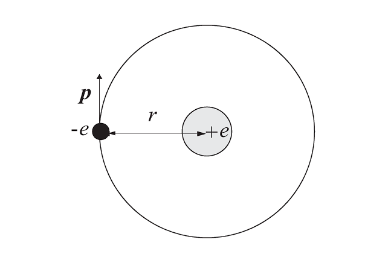
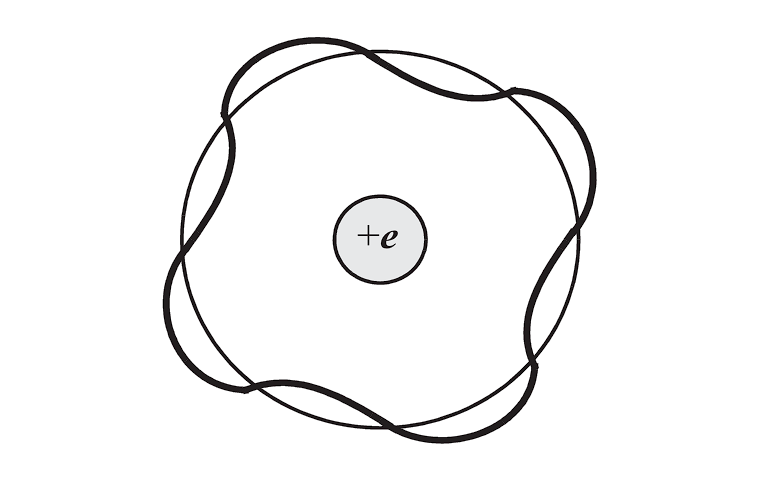

OK, so let's get started. First of all, welcome to the course of EE114. I'm your professor Keven, you can just call me "K". And in the following semester we will be talking about analog circuit design.

Some of you may have already seen the devices we will use in this class, like the diodes, bjt and mosfets. I know that you could draw their equivalent circuits using dependent sources and analyze their behavior when you learned *circuit analysis*.

However, the first step in our class is to make sure you have the basic understanding about the underlying physics of these devices, i.e semiconductors.

That's important. I mean, you should know why we use VCCS (Voltage Controlled Current Source) to model a mosfet, how does that **control** happen in physics? Where do the $r_o$ and $g_{mb}$ come from? What's the principles behind?

Mastery of these topics will give you more intuitions when designing circuits instead of being a ***spice monkey*** and blindly trying the size of the mosfets.

## Table of Contents

## Microscopic view of semiconductors

So let's get into semiconductors first. People usually associate semiconductors with Silicon. In fact, most of column IV elements of the periodic table or the III-V compounds are also kinds of semiconductors; we will explain this later. 

Now, let's take a look at the simplest hydrogen atom. *(K sketched a Bohr model of the hydrogen atom.)*

Remember that for a particle having a momentum of $p$ has a De Broglie wavelength given by

$$
\lambda = \frac{h}{p}
$$

where $h$ is the Planck's constant.

Now, for the electron to have a stable orbit, we must consider not only classical mechanical constraints but also specific conditions that its wavelength must satisfy.

It's ok if you haven't learned quantum mechanics. Consider that the electron needs to form standing De Broglie waves, which means that the wave of the electron cannot affect itself. In this case we require the circumference to be an integer multiple of the wavelength. Otherwise the wave may interfere with itself after one revolution, leading to destructive self-interference and orbital instability.

Therefore, we can write

$$
2\pi r = n\lambda = \frac{nh}{p}
$$

Applying Coulomb law and Newton's second law

$$
F = \frac{1}{4\pi\epsilon_0} \cdot \frac{e^2}{r^2} = ma = m\frac{v^2}{r} = \frac{p^2}{mr}
$$

we obtain
